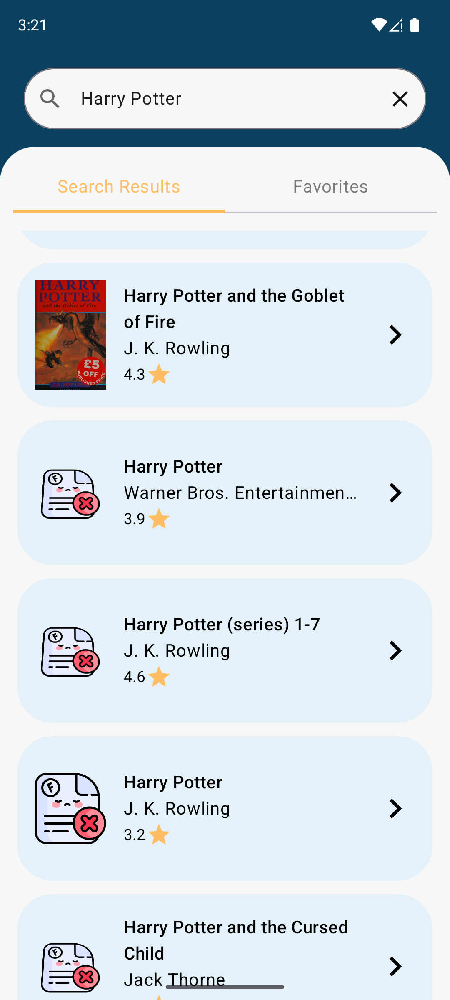
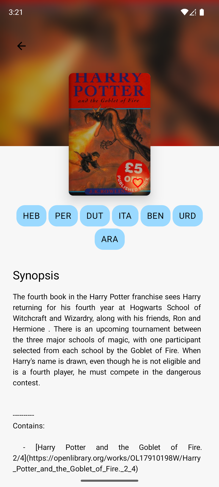

# 📚 BookPedia

**BookPedia** is a cross-platform demo project built using Kotlin Multiplatform (KMP) and Compose Multiplatform (CMP). The app fetches data from the OpenLibrary API to display a list of books, supports search functionality, and shows detailed information about each book.

## 🔥 Features

- 📖 Display a list of popular books
- 🔍 Search for books by title or author
- 📄 View detailed information for each book
- 🌐 Free and open API integration
- 🧭 Seamless navigation between screens
- 🧪 Modern architecture using KMP + CMP

---

## 🧰 Tech Stack

| Layer | Tools Used |
|-------|-------------|
| UI | [JetBrains Compose Multiplatform (CMP)](https://github.com/JetBrains/compose-multiplatform) |
| Network | [Ktor Client](https://ktor.io/docs/http-client.html) |
| Image Loading | [Coil](https://coil-kt.github.io/coil/) |
| Dependency Injection | [Koin](https://insert-koin.io/) |
| Local DB | [Room Database](https://developer.android.com/training/data-storage/room) |
| Serialization | [kotlinx.serialization](https://github.com/Kotlin/kotlinx.serialization) |
| Navigation | [Navigation-Compose (Navigation3)](https://developer.android.com/jetpack/compose/navigation) |

---

## 🌍 API Source

This project uses **[OpenLibrary API](https://openlibrary.org/)** — a free and open source for accessing book data.

---

## 🖼️ Screenshots




---

## 🚀 Getting Started

### Prerequisites

- Android Studio Flamingo or later
- Kotlin Multiplatform Plugin
- JDK 17+

### Run the project

1. Clone the repository:
   ```bash
   git clone https://github.com/your-username/BookPedia.git

👨‍💻 Developer
Developed by Shubham Kumar
Tech Stack: Kotlin Multiplatform (KMM) + Compose Multiplatform (CMP)

📄 License
This project is open source and available under the MIT License.


This is a Kotlin Multiplatform project targeting Android, iOS, Desktop.

* `/composeApp` is for code that will be shared across your Compose Multiplatform applications.
  It contains several subfolders:
  - `commonMain` is for code that’s common for all targets.
  - Other folders are for Kotlin code that will be compiled for only the platform indicated in the folder name.
    For example, if you want to use Apple’s CoreCrypto for the iOS part of your Kotlin app,
    `iosMain` would be the right folder for such calls.

* `/iosApp` contains iOS applications. Even if you’re sharing your UI with Compose Multiplatform, 
  you need this entry point for your iOS app. This is also where you should add SwiftUI code for your project.


Learn more about [Kotlin Multiplatform](https://www.jetbrains.com/help/kotlin-multiplatform-dev/get-started.html)…# CMP-Bookpedia
